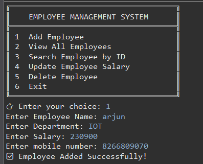
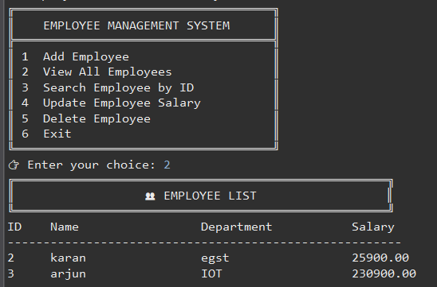
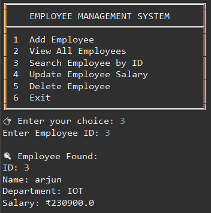
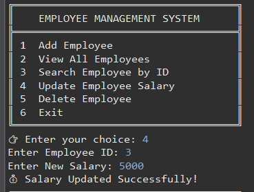
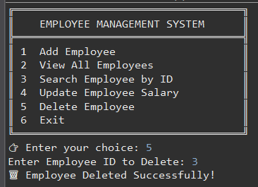
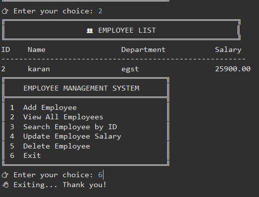

# 👨‍💼 Employee Management System (JDBC Project)

A simple **Java-based Employee Management System** built using **JDBC (Java Database Connectivity)** and **MySQL Database** — without using any frameworks like Spring, Hibernate, or Servlets.  
This project performs full **CRUD operations** (Create, Read, Update, Delete) directly using JDBC.

---

## 🚀 Features

✅ Add New Employee  
✅ View All Employees  
✅ Search Employee by ID  
✅ Update Employee Salary  
✅ Delete Employee Record  

---

## 🛠️ Tech Stack

| Technology | Description |
|-------------|-------------|
| **Java (JDK 17+)** | Core programming language |
| **JDBC API** | For database connectivity |
| **MySQL** | Backend database |
| **Eclipse IDE** | Development environment |

---

## ⚙️ Database Setup

Run the following SQL commands before running the project:

```sql
CREATE DATABASE employee_db_management;
USE employee_db_management;

CREATE TABLE employees (
    id INT AUTO_INCREMENT PRIMARY KEY,
    name VARCHAR(100),
    department VARCHAR(50),
    salary DECIMAL(10,2),
    mobile BIGINT
);






